# MERN_full_stack_web_app

This repo is for the implementation of the following book:
[**Pro MERN Stack Full Stack Web App Development with Mongo, Express, React, and Node 2nd Edition by Vasan Subramanian**](https://www.apress.com/gp/book/9781484243909)

## Chapter 3: React Components
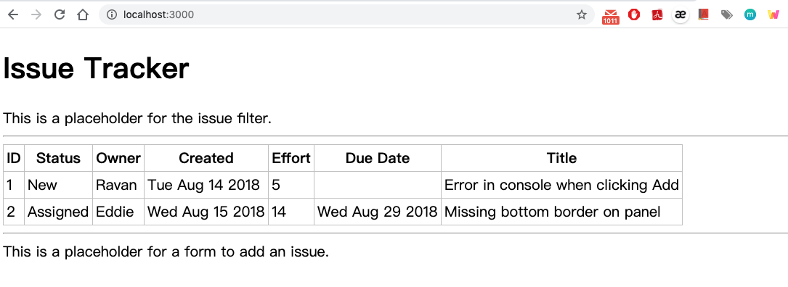

## Chapter 4: React State
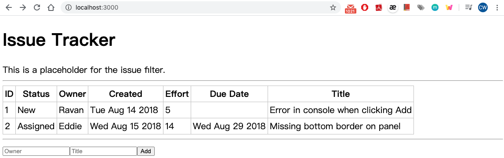

## Chapter 5: Express and GraphQL
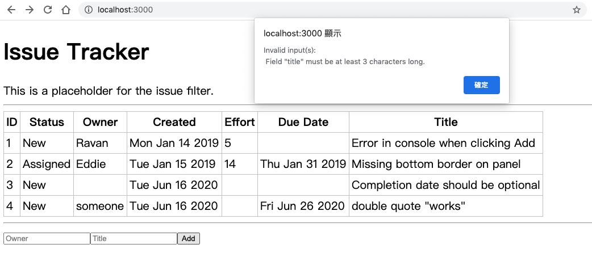

## Chapter 6: Mongo DB


## Chapter 7: Architecture and ESLint
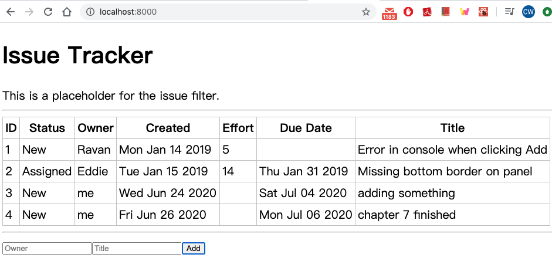
install different version of graphql to make npm start
`> npm install graphql@14.2.1`
`> npm install`
`> npm start`
Error on p.214 function IssueTable( {issue<b>s</b>} )

## Chapter 8: Modularization and Webpack
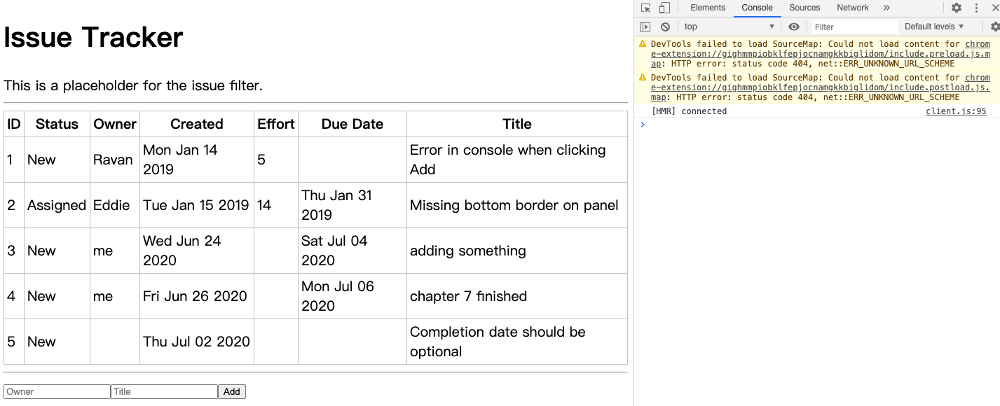

## Chapter 9: React Router
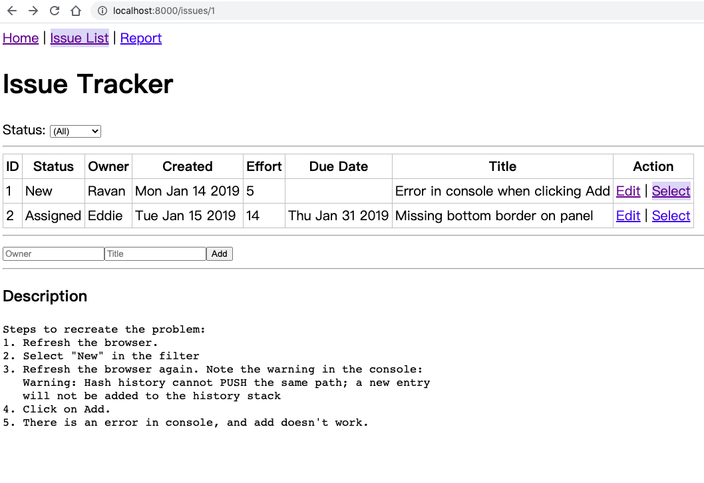
In listing 9-21, in the loadData() function in IssueDetail.jsx, a small change must be made in order to make the code work properly with recent versions of GraphQL.
  ```const data = await graphQLFetch(query, { id });```
needs to be changes as
  ```const data = await graphQLFetch(query, { id: parseInt(id, 10) });```

## Chapter 10: React Forms
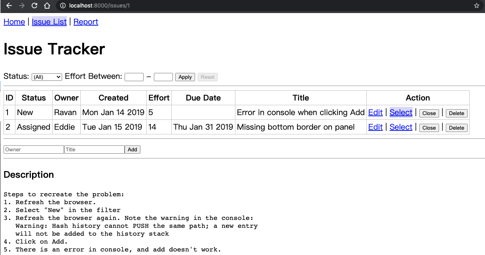
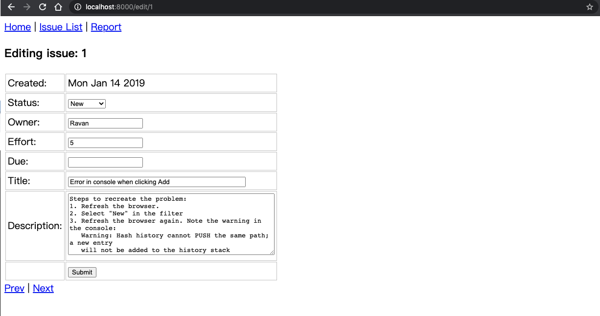
 In listing 10-7, in the loadData() function in IssueEdit.jsx, a small change 
 must be made in order to make the code work properly with recent versions of GraphQL. 
  ```const data = await graphQLFetch(query, { id });```
needs to be changes as
  ```const data = await graphQLFetch(query, { id: parseInt(id, 10) });```

The date validation described in the book does not work for Chrome. In fact, Chrome will allow an invalid date to be entered and then fail to render properly if one is entered. A solution (h/t to Magnus Frennberg) for this is as follows. In DateInput.jsx replace this code:

```
  function unformat(str) {
      const val = new Date(str);
      return Number.isNaN(val.getTime()) ? null : val;
  }
```
with
```
  function unformat(str) {
      const isDate = str.match(/^(19|20)\d\d[- /.](0[1-9]|1[012])[- /.](0[1-9]|[12][0-9]|3[01])$/);
      return isDate ? new Date(str) : null;
  }
```

## Chapter 11: React-Bootstrap
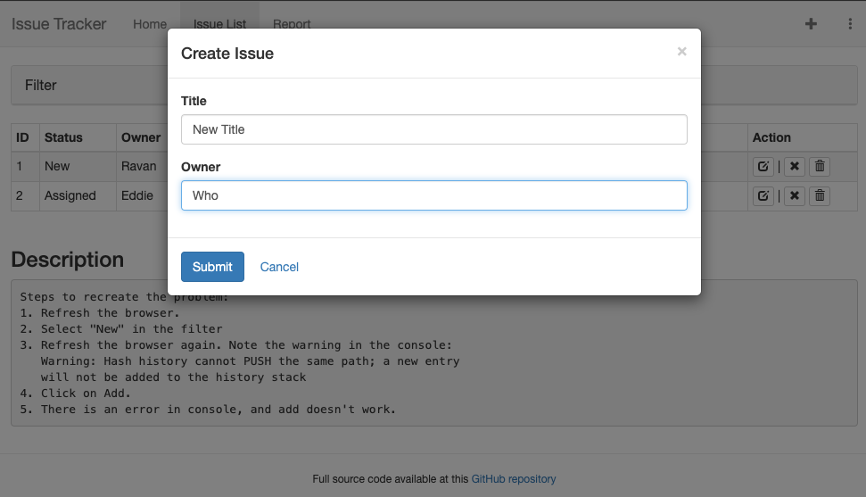

## Chapter 12: Server Rendering
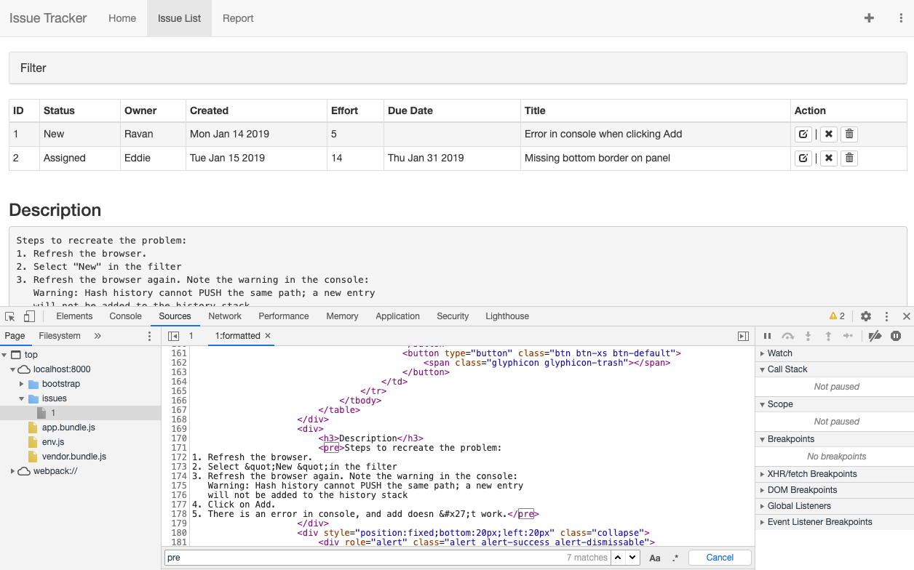

## Chapter 13: Advanced Features
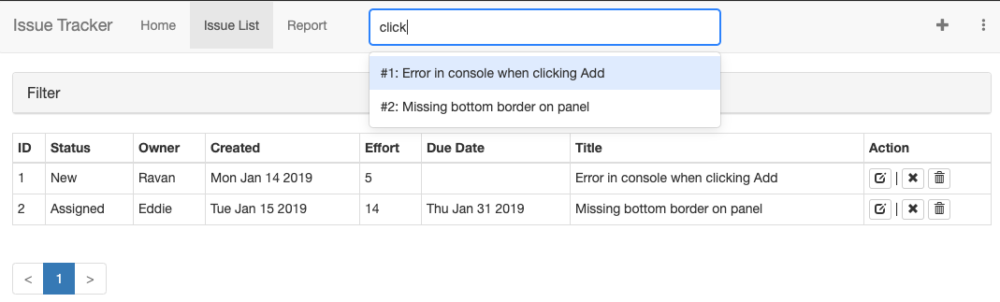
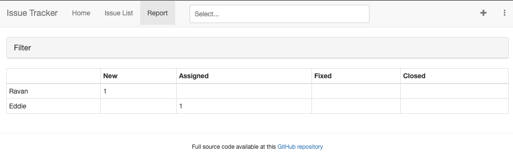

## Chapter 14: Authentication
OAuth2 credentials: Add "http://localhost:8080" to Restrictions- Authorized JavaScript origins. Add Google Analytics Api to the project and enable it. Then clear browsing cache.